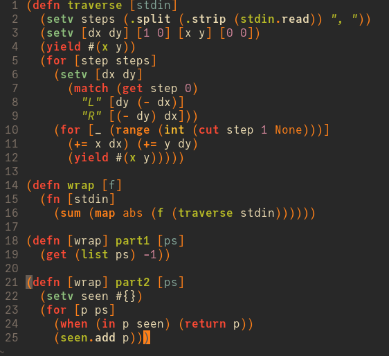

# tree-sitter-hy

Tree-sitter grammar for [Hy][hy], a Lisp-ification of Python.

_Quick disclaimer:_ this is my first attempt at writing a tree-sitter grammar, so some things may be done incorrectly or in non-standard ways. Please help me polish this project up by opening issues/PRs; thanks!

[hy]: http://hylang.org

## Syntax highlighting screenshots/examples



## Installation and usage with nvim-treesitter

Hy is a new-ish language, to the point where Neovim doesn't automatically recognize the `.hy` extension yet. On top of that, this grammar is in alpha stage (very incomplete, missing lots of features, actively being developed, etc.), so it hasn't been officially added to the [nvim-treesitter][nvim-treesitter] repository yet. Therefore, using this grammar takes a few extra lines of configuration.

1. First, register the `.hy` extension to detect as `hy` filetype:

   - Example using [Neovim's Lua `filetype` API][nvim-lua-filetype] (requires at least Neovim 0.7):
     ```lua
     vim.filetype.add {
       extension = {
         hy = "hy",
       },
     }
     ```
   - Example using old-style autocommand (Vimscript):
     ```vim
     autocmd BufNewFile,BufRead *.hy setfiletype hy
     ```

2. Assuming you already have nvim-treesitter installed, and have already enabled syntax highlighting with nvim-treesitter, register/declare this grammar repository in nvim-treesitter (Lua configuration; adapted from example in [nvim-treesitter documentation][nvim-treesitter-declare]):

   ```lua
   local parser_config = require "nvim-treesitter.parsers".get_parser_configs()
   parser_config.hy = {
     install_info = {
       url = "https://github.com/kwshi/tree-sitter-hy",
       files = {"src/parser.c"},
       branch = "main",
       generate_requires_npm = false,
       requires_generate_from_grammar = false,
     },
     filetype = "hy",
   }
   ```

3. Restart Neovim, then run `:TSInstall hy`.

   You'll also need to _manually_ add syntax-highlighting queries to your local installation of Neovim, since `:TSInstall` only installs the grammar itself, but not the queries. To do so, download the [queries/][queries/] folder in this repository, and save it to a [queries/] folder anywhere in your Neovim runtimepath, e.g., `~/.config/nvim`. Example folder structure:

   - `~/.config/nvim`
     - `init.lua` or `init.vim`, etc.
     - `queries`
       - `hy`
         - `highlights.scm`

4. Open a Hy file, and syntax highlighting should (mostly) work!

[nvim-treesitter]: https://github.com/nvim-treesitter/nvim-treesitter
[nvim-treesitter-declare]: https://github.com/nvim-treesitter/nvim-treesitter/tree/master#adding-parsers
[nvim-lua-filetype]: https://neovim.io/doc/user/lua.html#vim.filetype

## WIP checklist

Currently developed against the Hy version **0.27.0** documentation.

The grammar and highlighting definitions are actively work-in-progress. They're good enough for basic syntax highlighting, but many features are missing. Based on the [Hy syntax reference][hy-syntax-reference], here is the progress on implementing all Hy syntax features:

- [ ] non-form syntactic elements:
  - [x] shebang
  - [x] whitespace (automatically, using tree-sitter default settings)
  - [x] comments
  - [ ] discard prefix
- [ ] identifiers:
  - [x] numeric literals
    - [x] integer
    - [x] float
    - [x] complex
  - [x] keywords
  - [ ] dotted identifiers
    - partial support: dotted identifiers are parsed correctly, but dots-only identifiers such as `.` and `...` are currently parsed as dotted identifiers when instead they should be special-cased as symbols.
  - [ ] symbols
    - partial support: I think the current definition in the grammar is mostly correct, but a few special cases such as dots-only identifiers are missing.
- [ ] string literals:
  - [ ] plain strings (defined, but extremely basic and incomplete; doesn't support escapes)
  - [ ] raw strings
  - [ ] f-strings
  - [ ] bytes strings
  - [ ] bracket strings
- [ ] sequential forms:
  - [x] expressions
  - [ ] container literals:
    - [x] lists
    - [ ] tuples
    - [ ] sets
    - [ ] dicts
- [ ] additional sugar:
  - [ ] quoting/unquoting forms
- [ ] reader macros

Syntax highlighting is determined not only by the grammar, but also by specific patterns occurring in the syntax tree. For example, `(return 3)` and `(print 3)` have the same syntactic structure but should be highlighted differently since `return` is a language keyword/macro, whereas `print` is just a built-in run-time function. These patterns are extracted/differentiated using [tree-sitter queries][nvim-treesitter-queries] formulated according to the [Hy builtin macros API][hy-builtin-macros]. Here is a rough progress checklist on support for these special forms/macros:

- [ ] core macros:
  - [ ] `annotate`
  - [x] `let`
  - [ ] variables: `setv` `setx`
    - basic support, but missing support for type-annotated `setv`
  - [x] conditionals: `if` `when` `cond` `match`
  - [x] loops: `for` `while`
  - [x] comprehensions: `gfor` `lfor` `sfor` `dfor`
  - [ ] function definitions: `fn` `defn`
    - basic support, but `defn` query is missing support for optional decorator and annotation components
    - also missing support for async equivalents `fn/a`, `defn/a`, etc.
  - [ ] class definitions: `defclass
    - minimal/basic support
  - [ ] operators:
    - [x] boolean: `and` `or` `not`
    - [x] indexing/key access: `get` `in` `cut`
    - [x] arithmetic: `+` `-` `*` `/` `//` `+=` `-=`
    - [x] comparison: `<` `<=` `>` `>=` `=` `!=`
    - [ ] (lots of missing operators)
  - [x] control-flow keywords: `return` `yield`
  - [x] `chainc`
  - [ ] (and lots more)
- [ ] Python builtins:
  - [ ] functions:
    - [x] `sum` `map` `abs` `range` `len`
    - [ ] (several missing)
  - [ ] types:
    - [x] `int` `str` `bool`
    - [ ] (several missing)
  - [ ] constants:
    - [x] `True` `False` `None`
    - [ ] (others?)

Lots of other things are also still missing from a standard tree-sitter grammar, e.g., other query definitions such as `locals.scm`, various bindings (?), etc. Please feel free to contribute and help me get this project going!

[hy-syntax-reference]: https://docs.hylang.org/en/stable/syntax.html
[nvim-treesitter-queries]: https://github.com/nvim-treesitter/nvim-treesitter/blob/master/CONTRIBUTING.md#parser-configurations
[hy-builtin-macros]: https://docs.hylang.org/en/stable/api.html
